# WasteWise: Empowering Sustainable Cities 🌍♻️

Excited to share my work on WasteWise, a mobile app designed to support UNICEF’s Sustainable Development Goal 12 (Responsible Consumption and Production) by enhancing waste management. Developed with Flutter, the app streamlines waste management processes while promoting sustainable living.

## Features

📌 Core Features: 
Pickup Scheduling: Providing quick and efficient waste pickup scheduling for customers. 
Google Maps Integration: Vendors can easily locate pickup points. 
Recycled Products Marketplace: Users can browse and purchase eco-friendly products like biodegradable bags, bottles, and papers. 
Push Notifications: Get instant alerts for new recycled products or price drops on eco-friendly items. 
Waste Type Categorization: Clear categorization of waste types and schedules. 
Pickup Status Management: Vendors can accept or decline requests in real-time. 

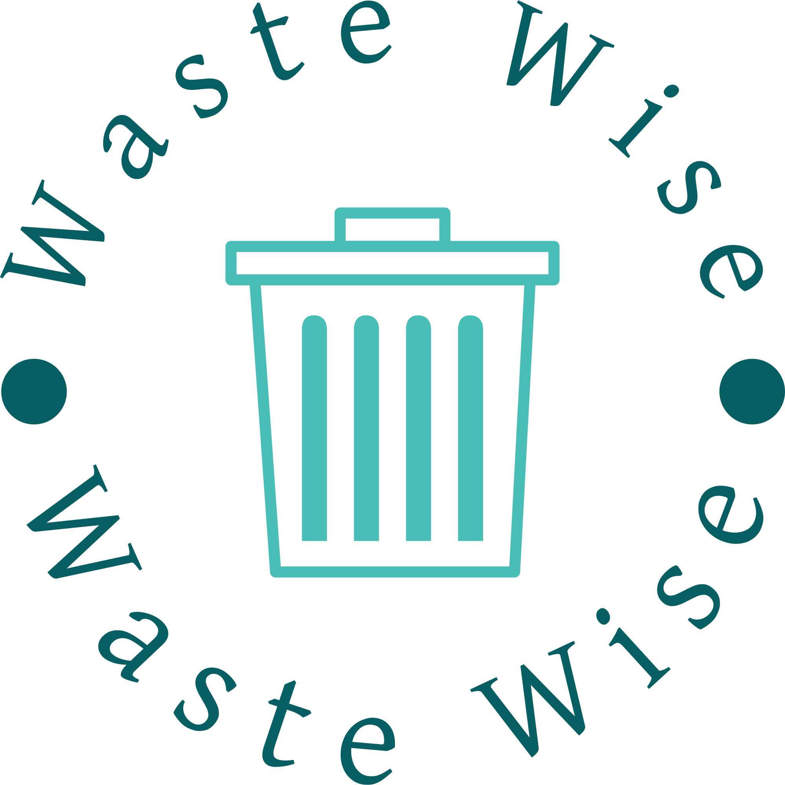

## Screenshots

    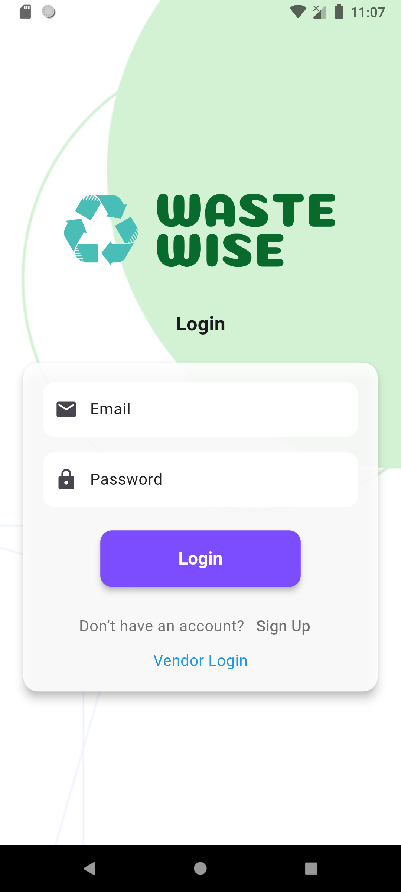
    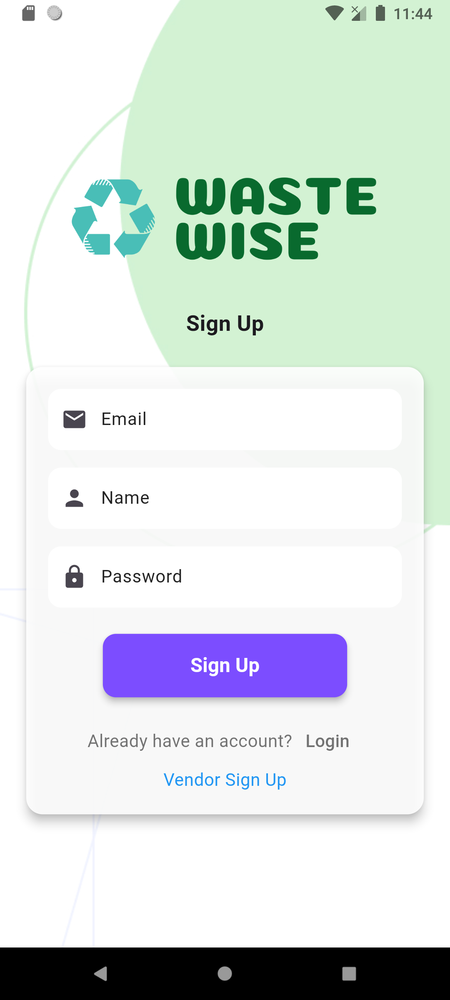
    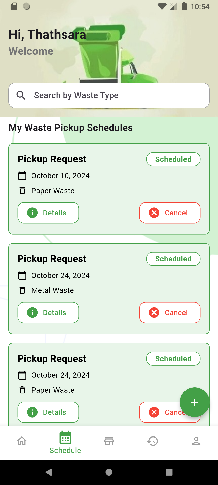
    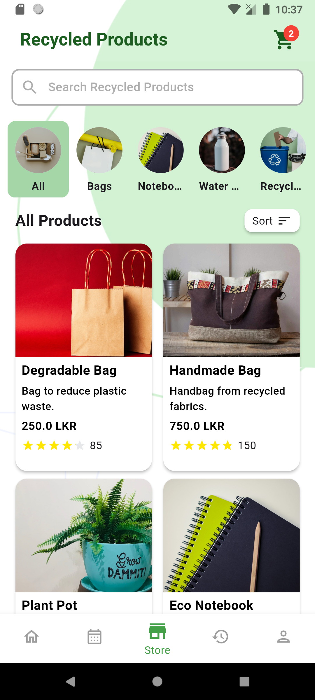
    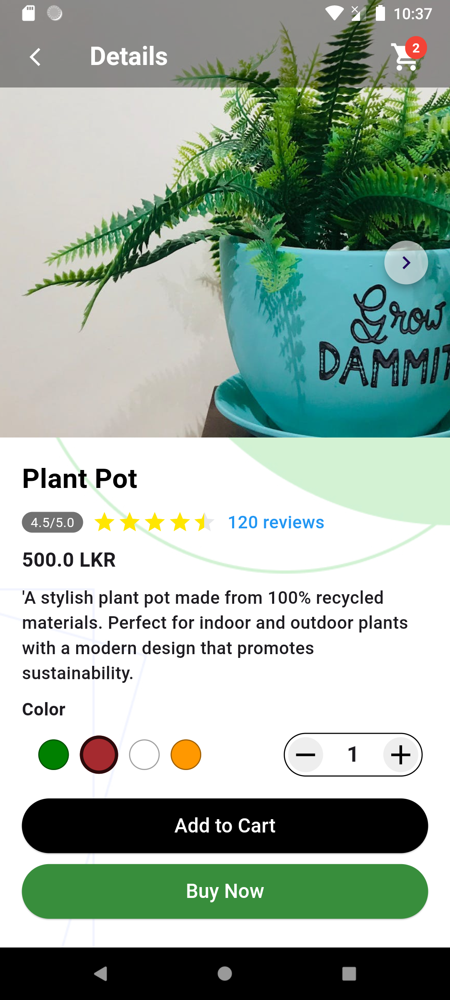
    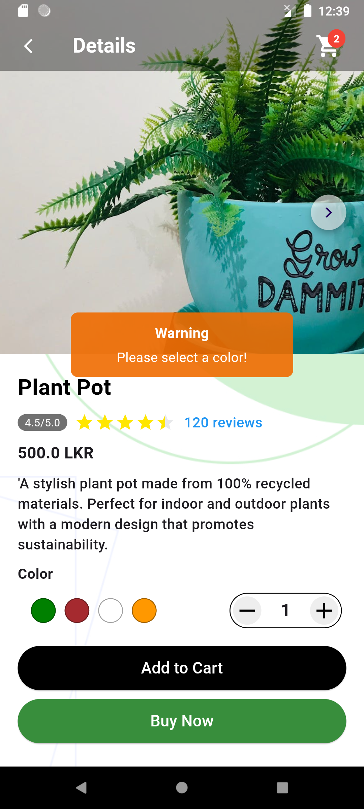
    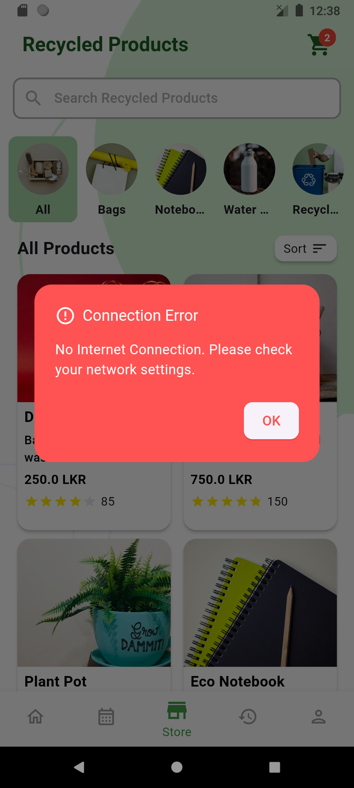
    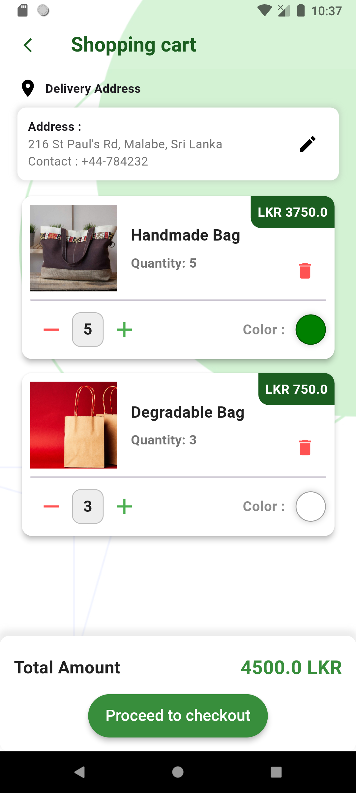
    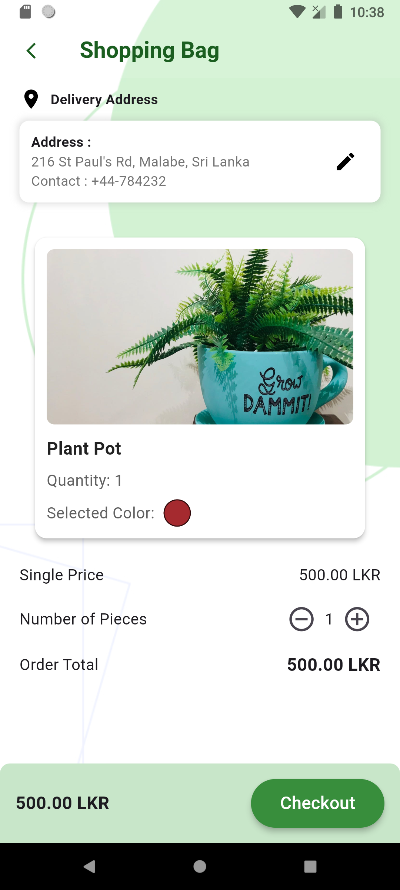
    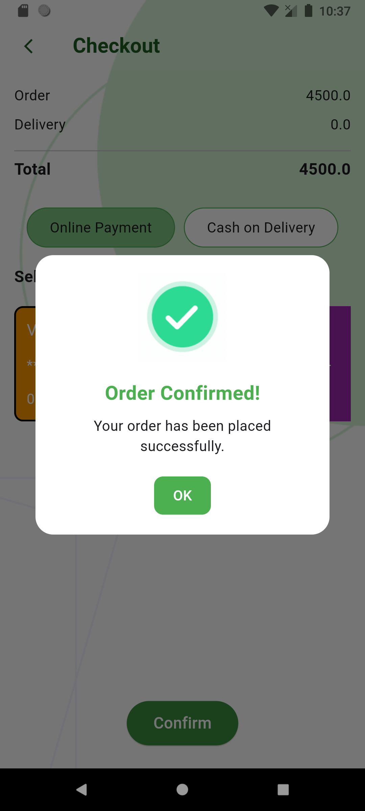
    
    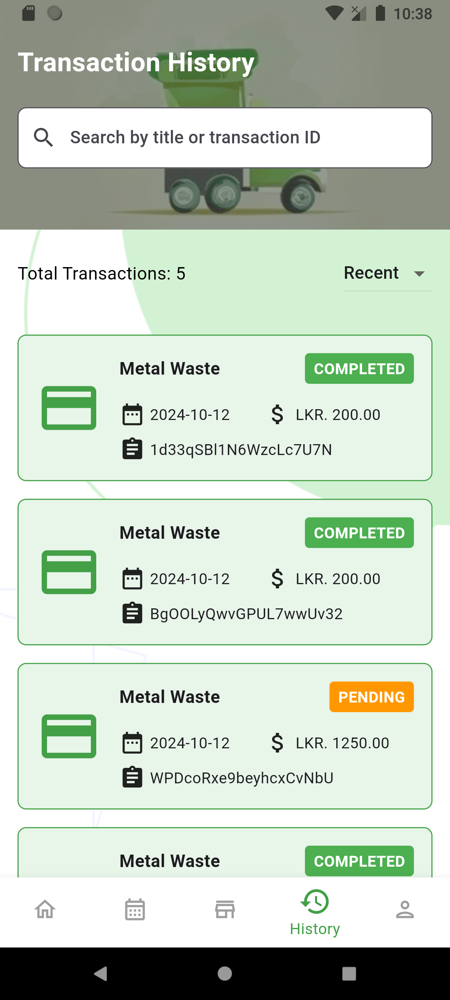
    

